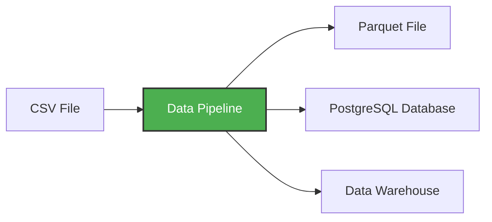

# Data Pipeline

Un data pipeline es un servicio o proceso que recibe datos como entrada y produce nuevos datos como salida.
Básicamente es una cadena de pasos que mueve y transforma datos.
* Datos → Transformación → Almacenamiento

El pipeline.py es un script que:
* Descarga datos CSV desde internet
* Transforma y limpia los datos usando pandas
* Carga los datos en PostgreSQL para poder consultarlos
* Procesa los datos en bloques (chunks) para poder manejar archivos grandes