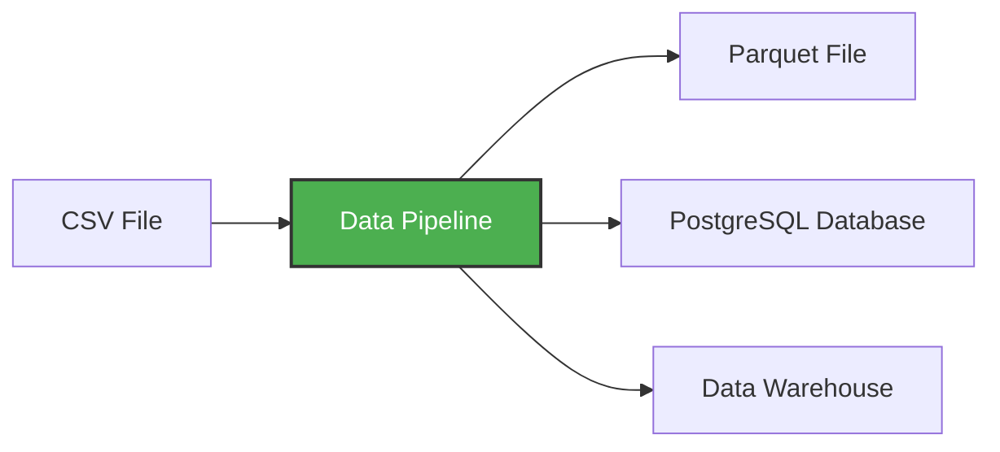

# Docker

## Qué es Docker

Docker es un software que permite ejecutar aplicaciones y su entorno de forma aislada en contenedores, de forma similar a una máquina virtual, pero mucho más liviano y rápido.

En lugar de instalar programas directamente en tu sistema operativo, Docker ejecuta las aplicaciones dentro de contenedores que incluyen todo lo necesario para que funcionen (igual que en cualquier servidor).

Ventajas:
* Reproducibilidad: El mismo entorno funciona en cualquier máquina.
* Aislamiento: Las aplicaciones no interfieren entre sí.
* Portabilidad: Funciona en local, servidores o nube.

## Conceptos principales

* Imagen (Image): Es una plantilla que contiene todo lo necesario para ejecutar un programa.

* Contenedor (Container): Es una instancia de una imagen en ejecución.

* Volumen (Volume): Los contenedores no guardan cambios por defecto, cada contenedor inicia desde la imagen original. Un volumen conecta una carpeta real de tu computadora con una carpeta del contenedor.

* Dockerfile: define cómo construir una imagen.

* Docker Compose: archivo que permite ejecutar múltiples contenedores con un solo comando.

### Comandos principales

Ver versión
```bash
docker --version
```

---
Descargar una imagen
```bash
docker pull ubuntu
```
Ver imágenes
```bash
docker images
```
Eliminar imagen
```bash
docker rmi image_name
```

---
Ejecutar contenedor interactivo (-i interactivo y -t terminal) a partir de una imagen
```bash
docker run -it ubuntu
```
Ver contenedores activos
```bash
docker ps
```
Ver todos los contenedores
```bash
docker ps -a
```
Eliminar contenedor (En un contenedor de base de datos, los datos no se borran gracias al volumen)
```bash
docker rm container_id
```

---
Montar volumen
```bash
docker run -v $(pwd)/data:/app/data ubuntu
```
* Crea y ejecuta un contenedor a partir de la imagen ubuntu
* -v significa volume mount. Conecta una carpeta de tu computadora con una carpeta dentro del contenedor.
* Formato general:
```bash
HOST_PATH : CONTAINER_PATH
```
Entonces carpeta de mi computadora ($(pwd)/data) : carpeta dentro del contenedor (/app/data)

---
Iniciar servicios Docker Compose
```bash
docker compose up
```
Detener servicios Docker Compose
```bash
docker compose down
```
Ver contenedores Docker Compose
```bash
docker compose ps
```

### Flujo

Cuando ejecutas docker compose up, Docker Compose hace lo siguiente:
* 1 Lee docker-compose.yml
* 2 Identifica los servicios
* 3 Para cada servicio:
  ** usa una imagen existente
  ** o construye una imagen desde un Dockerfile
* 4 Crea contenedores a partir de esas imágenes
* 5 Configura red, puertos y volúmenes
* 6 Inicia los contenedores

# Data Pipeline

Un data pipeline es un servicio o proceso que recibe datos como entrada y produce nuevos datos como salida.
Básicamente es una cadena de pasos que mueve y transforma datos.
* Datos → Transformación → Almacenamiento


El pipeline.py es un script que:
* Descarga datos CSV desde internet
* Transforma y limpia los datos usando pandas
* Carga los datos en PostgreSQL para poder consultarlos
* Procesa los datos en bloques (chunks) para poder manejar archivos grandes

## Environment

El problema es que necesitás usar librerías como pandas y pyarrow en tu proyecto, y la forma rápida sería instalarlas con pip install. El inconveniente es que eso las instala en el Python global de tu sistema. Cuando distintos proyectos necesitan versiones diferentes de las mismas librerías, empiezan los conflictos: actualizar algo para un proyecto puede romper otro, y tu entorno se vuelve difícil de mantener y reproducir.

Para evitar eso se usan virtual environments, que son entornos de Python aislados por proyecto. Cada proyecto tiene su propio Python y sus propias dependencias, sin interferir con otros proyectos ni con el sistema.

Acá entra uv, una herramienta moderna que maneja automáticamente estos entornos aislados. Primero instalás uv una sola vez en tu máquina. Luego, dentro del proyecto, corrés uv init --python=3.13, lo que crea los archivos necesarios para definir el entorno y las dependencias del proyecto. Después agregás las librerías con uv add pandas pyarrow, que las registra en el archivo del proyecto y las instala solo en ese entorno aislado.

Cuando ejecutás el programa con uv run python pipeline.py 10, uv usa automáticamente ese entorno virtual sin que tengas que activarlo manualmente. Esto permite probar y depurar tu código localmente de forma limpia antes de llevarlo a un contenedor Docker.

```bash
pip install uv
```
```bash
uv init --python 3.13
```
```bash
uv add pandas pyarrow
```
```bash
uv run python pipeline.py 10
```

En pipeline.py, VS Code necesita saber qué intérprete de Python usar para ejecutar el código, autocompletar, resolver imports y depurar. Por defecto apunta al Python global. Para evitar errores con las dependencias instaladas por uv, hay que seleccionar el intérprete dentro de .venv/Scripts/python.exe. Así, el editor, el linter, el autocompletado, el debugger y el botón Run usan el mismo entorno que uv run.

## Dockerizando el pipeline

Primero probás con uv porque es rápido para desarrollar y depurar.
Después pasás el pipeline a Docker para que sea portable, reproducible y desplegable.

Además, los orquestadores y schedulers reales no corren “scripts Python”. Corren contenedores. Por ejemplo: Apache Airflow, Kubernetes, Google Cloud Run, AWS Batch, etc.

Dockerfile debe usar uv asi Docker instala exactamente las mismas versiones que ya probaste localmente con uv. El contenedor queda alineado 1:1 con el entorno de desarrollo.

* Abrir Docker Desktop

* Construir la imagen
```bash
docker build -t test:pandas .
```

* Correr el contenedor pasando el día (por ejemplo 10)
```bash
docker run --rm -it test:pandas 10
```

# Levantar PostgreSQL con Docker

Ese contenedor ya trae Postgres instalado y configurado. Solo tenés que decirle: usuario, contraseña, nombre de base y dónde guardar los datos

```bash
docker run -it --rm `
  -e POSTGRES_USER="root" `
  -e POSTGRES_PASSWORD="root" `
  -e POSTGRES_DB="ny_taxi" `
  -v ny_taxi_postgres_data:/var/lib/postgresql `
  -p 5432:5432 `
  postgres:18
```
Dejarlo corriendo y abrir nueva terminal

* docker run: Crea y ejecuta un contenedor.
* -it: Modo interactivo (ves los logs de Postgres corriendo).
* --rm: Cuando el contenedor se apaga, se borra. Pero los datos NO se borran (gracias al volumen).
* -e son las variables de entorno
* -v es el volumen. Postgres guarda en el contenedor los datos en: /var/lib/postgresql. Docker mapea eso a un volumen persistente llamado ny_taxi_postgres_data

## Ejecutar comandos SQL en la BDD con psql
Te permite conectarte a Postgres y escribir SQL desde la terminal, con autocompletado, colores y ayudas.

* Verificar que el contenedor esté corriendo
```bash
docker ps
```

* Copiar el CONTAINER ID

* Entrar al Postgres dentro del contenedor con psql
```bash
docker exec -it <CONTAINER_ID> psql -U root -d ny_taxi
```

* ny_taxi=# significa que estás dentro de la base

* Probar que funciona (SQL)
```bash
CREATE TABLE test (id INTEGER, name VARCHAR(50));
```
```bash
INSERT INTO test VALUES (1, 'Hello Docker');
```
```bash
SELECT * FROM test;
```

* Listar tablas
```bash
\dt
```

* Salir de psql
```bash
\q
```

# NY Taxi Dataset e ingestión de datos

## Jupiter
Jupyter es una aplicación que te deja ejecutar código por bloques (celdas), ver resultados al instante y mezclar: código Python, tablas (pandas), gráficos, texto explicativo. Todo en el navegador.
Jupyter usa tu .venv local para ejecutar notebooks que se conectan al Postgres del contenedor.

* Instalar Jupyter
```bash
uv add --dev jupyter
```

* Iniciar Jupyter notebook para explorar los datos
```bash
uv run jupyter notebook
```

* Crear notebook
En el browser de Jupyter ir a New/ Pythpn 3 (ipykernel) / renombrar a notebook.ipynb